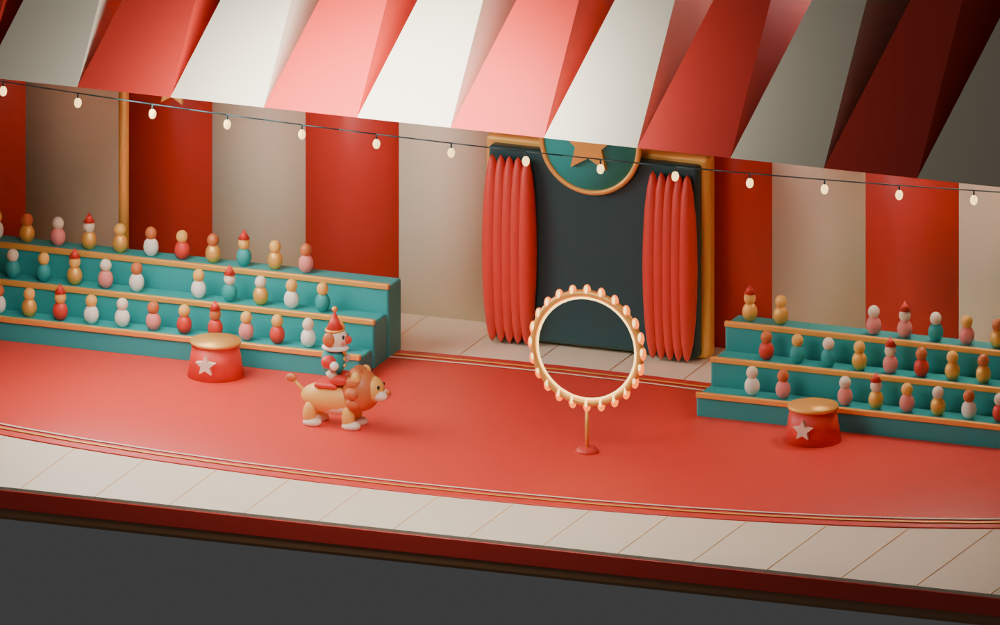

# CIRQUE — One More Show

**A little courage. A little chaos. A whole lot of ta-da.**

A complete browser arcade game: original Blender characters and scenery, three circus acts, jump-and-trick gameplay, and an original adaptive carnival soundtrack. Built for the September 2026 Game Builder competition.

## Play

**[Step right up — play CIRQUE](https://rigomaru.github.io/Circus-VideoGame/)**

Desktop: **Space / ↑ / W** to jump, **X** while rising to somersault, **Esc / P** to pause, **M** to mute. On mobile, use the JUMP and TRICK buttons; landscape gives you a larger stage.

Jump roughly half a second before a hazard reaches you. Follow the golden stars. Clear three consecutive hazards to increase the multiplier, up to 5×. Complete all three acts for a surviving-heart bonus. Restart instantly to chase your best.

| Mode | The show |
| --- | --- |
| The Show | Three 30-second acts: fire hoops, rolling barrels, mixed finale |
| Daily Ticket | A course seeded from today's UTC date; separate daily records |
| Encore | Endless acts with a gradually increasing pace |
| Chill setting | Slower movement and five hearts; separate records |

Scores are local to your browser. There is no online leaderboard, account requirement, or data collection.

## Run locally

Requires **Node.js 22.12+ or 24+**.

```sh
npm ci
npm run dev
```

Open the localhost address printed by Vite. To test the production version:

```sh
npm test
npm run build
npm run preview
```

The production build is `dist/`. It is static, uses relative asset URLs and can be hosted on GitHub Pages, Netlify, or any static web server. Opening `index.html` directly using `file://` will not work; serve the game over HTTP. All models and typefaces are bundled, and music is synthesized locally after your first interaction.

## Made in Blender, step by step

The original editable project is **[art/cirque.blend](art/cirque.blend)**. Six exported GLB files in `public/models/` are loaded by the actual game. These are real mesh assets created in Blender, not screenshots or placeholder asset links.



1. [Creative direction](docs/01-direction.md)
2. [Blender modeling and exports](docs/02-blender.md)
3. [Gameplay and controls](docs/03-gameplay.md)
4. [Original music and sound](docs/04-sound.md)
5. [Validation and competition submission](docs/05-submission.md)

Rebuild the assets with Blender 5.2 (or a compatible modern Blender version):

```sh
blender --background --python art/build_assets.py
# Also render the presentation image:
blender --background --python art/build_assets.py -- --render
```

The generator re-creates the scene from scratch and overwrites generated models and the `.blend`; save hand-edited versions separately before regenerating. The saved presentation scene offsets the lion and hoop for the composition, while exports are produced at their game origins.

## Technology and provenance

Three.js renders batched Blender geometry; Vite bundles the application. Gameplay is separated from rendering and audio for deterministic simulation tests. Web Audio generates all music and effects. There are no paid APIs, backend services, API keys, downloaded music recordings or stock character models.

An original homage to the circus variety and simple timing of **Circus Charlie**. No Konami sprites, character meshes, logos, recordings, or game code are included. The original composition is **“One More Show”**; it uses its own melody. Typeface dependencies are DM Sans and Fraunces, distributed under the SIL Open Font License. Three.js and Vite retain their respective upstream licenses.

GitHub Actions runs the tests, creates the production build and deploys to GitHub Pages on pushes to `main`. The repository's Pages source must be **GitHub Actions**.
